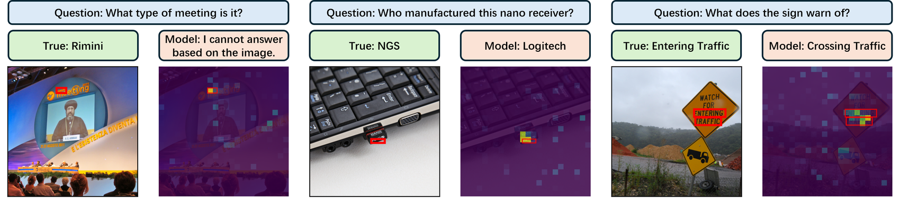
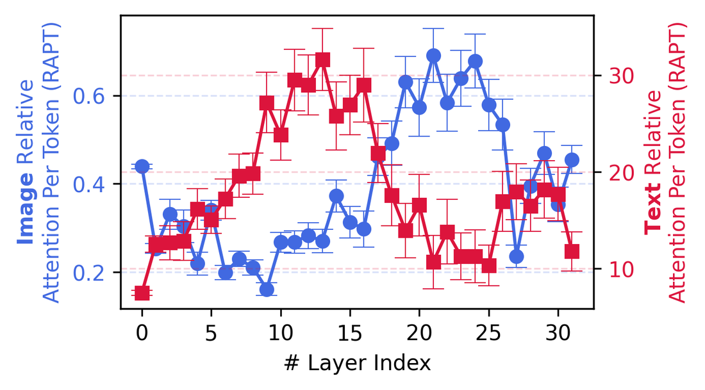
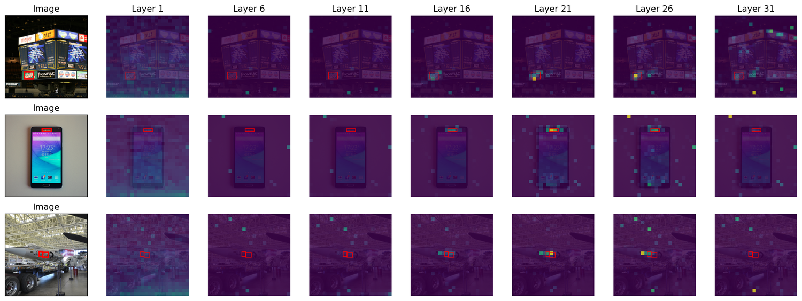
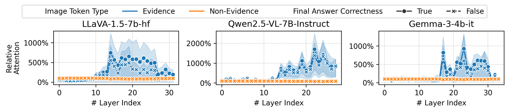
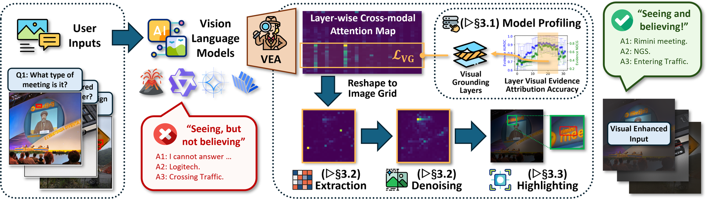
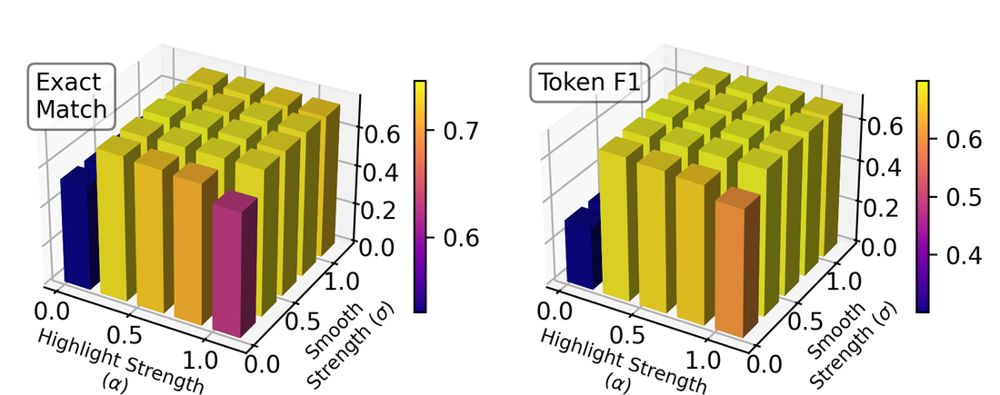
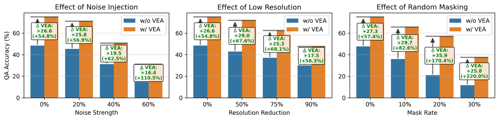

<div align="center">


### Seeing but Not Believing &nbsp;·&nbsp; ICLR 2026<br><sub>Probing the Disconnect Between Visual Attention and Answer Correctness in VLMs</sub>

[](https://arxiv.org/abs/2510.17771)
[](https://zhiningliu.com/VEA/)
[](https://www.python.org/)
[](https://pytorch.org/)
[](LICENSE)

**[Paper](https://arxiv.org/abs/2510.17771)** &nbsp;·&nbsp;
**[Project Page](https://zhiningliu.com/VEA/)** &nbsp;·&nbsp;
**[Quickstart](#quickstart)** &nbsp;·&nbsp;
**[Results](#results)** &nbsp;·&nbsp;
**[Citation](#citation)**

</div>

---

> **TL;DR** — When a VLM answers a visual question wrongly, it usually *did* look at the right part of the
> image. Its deep layers attend to the annotated evidence almost as sharply on questions it gets wrong as on
> ones it gets right. **Vea** exploits this: one forward pass reveals where those layers look, the image is
> re-shown with everything else dimmed, and accuracy rises by **+5.7 EM on average (up to +11.1)** across 8
> VLMs — with **no training, no fine-tuning, and no weight access.**

---

## The finding: seeing but not believing

The intuitive explanation for a wrong answer is a perception failure — the model never saw the evidence. That
turns out to be the wrong diagnosis.

<div align="center">

<br><em>Deep layers attend to the correct evidence region (<strong>red boxes</strong>), yet the answers are still
wrong — false rejection, hallucination, and partially-correct failures.</em>
</div>

The evidence is located. It is then discarded downstream. Three observations make this precise.

<table>
<tr><td width="50%" valign="top">

**1. Attention migrates from text to image with depth.**

Early layers are dominated by text tokens; image tokens gain attention progressively deeper in the stack.

</td><td width="50%" valign="top">

**2. Deep layers are sparse but accurate.**

Shallow layers spread weak attention everywhere. Deep layers lock onto small regions that coincide with the
ground-truth evidence.

</td></tr>
<tr><td valign="top">

</td><td valign="top">

</td></tr>
</table>

**3. The targeting barely weakens when the answer is wrong.** This is the crux.

<div align="center">

<br><em>Attention to <strong>evidence</strong> vs. <strong>non-evidence</strong> image tokens across layers, for
four VLM families. Dashed lines are <strong>incorrect</strong> answers — deep layers still strongly prefer the
evidence.</em>
</div>

So the bottleneck is not perception, it is **utilisation**. The signal is already inside the model; it just
fails to reach the answer.

## The method: Visual Evidence Augmentation

If the model has already found the evidence, the cheapest intervention is to make that evidence impossible to
ignore — by surfacing the model's *own* attention back into its input.

<div align="center">

</div>

| Step | What happens | Cost | Code |
|:--|:--|:--|:--|
| **A** · Profiling | Score every layer by how well its attention *ranks* evidence patches (AUROC); keep the top 10%. | once per model | [`profiling.py`](vea/profiling.py) |
| **B** · Attribution | Average those layers' attention over image tokens → one score per patch. `Eq. 1` | 1 forward pass | [`attention.py`](vea/attention.py) |
| **C** · Denoising | Replace isolated attention spikes with their local mean (λ=10). `Eq. 2` | free | [`highlight.py`](vea/highlight.py) |
| **D** · Smoothing | Gaussian blur (σ=0.5 × shorter side), removing blocky patch borders. `Eq. 3` | free | [`highlight.py`](vea/highlight.py) |
| **E** · Highlighting | Scale pixel brightness by `α + (1−α)·evidence`, α=0.5. `Eq. 4` | free | [`highlight.py`](vea/highlight.py) |

No gradients, no captioning pass, no second generation — a **single-token forward pass** is enough to build the
augmented image.

## Results

### Answer accuracy (Exact Match, averaged over 4 VQA tasks)

| Method | LLaVA-NeXT 7B | 13B | Qwen2.5-VL 7B | 32B | Gemma3 4B | 27B | InternVL3.5 8B | 14B | Avg. Rank ↓ |
|:--|:--|:--|:--|:--|:--|:--|:--|:--|:--|
| Base | 38.5 | 49.4 | 73.4 | 69.3 | 56.6 | 69.3 | 79.3 | 79.3 | 5.38 |
| Inst | 38.8 | 50.2 | 73.9 | 69.0 | 56.0 | 70.2 | 79.2 | 78.8 | 5.47 |
| CGR&nbsp;† | 45.4 | 52.7 | 76.1 | 73.0 | 60.4 | 72.3 | 82.4 | 81.7 | 3.09 |
| VAR&nbsp;† | 42.7 | 51.5 | 76.4 | 70.4 | 58.0 | 73.4 | 80.2 | 80.4 | 3.44 |
| AGLA&nbsp;† | 46.4 | 53.4 | 77.9 | 73.8 | 60.4 | 74.2 | 82.3 | 82.3 | 2.50 |
| **Vea** | **49.6**<br><sub>+11.1</sub> | **54.1**<br><sub>+4.7</sub> | **78.4**<br><sub>+4.9</sub> | **75.8**<br><sub>+6.5</sub> | **61.2**<br><sub>+4.6</sub> | **75.3**<br><sub>+6.0</sub> | **83.2**<br><sub>+3.9</sub> | **82.9**<br><sub>+3.6</sub> | **1.12** |

Vea ranks first on **every** model. Token-F1 tells the same story (avg. rank **1.22**, up to **+17.3**). Gains
are largest on the smaller models, which have the most unused signal to recover.

> **†** CGR, VAR and AGLA were run from their authors' implementations and are **not** reimplemented in this
> repo — see [Scope](#scope-of-this-release). `Base`, `Inst` and `Vea` are all reproducible here.

### Evidence attribution accuracy (AUROC / NDCG@all)

Does Vea's layer selection actually localise evidence better than a fixed depth range?

| Attribution | LLaVA 7B | LLaVA 13B | Qwen 7B | Qwen 32B | Gemma 4B | Gemma 27B | Avg. Rank ↓ |
|:--|:--|:--|:--|:--|:--|:--|:--|
| L<sub>0–100%</sub> | 75.9 / 47.2 | 76.3 / 47.2 | 68.5 / 41.7 | 57.0 / 33.0 | 59.5 / 35.5 | 61.8 / 36.4 | 4.33 / 4.42 |
| L<sub>0–50%</sub> | 68.2 / 43.2 | 73.1 / 46.4 | 59.4 / 34.2 | 51.3 / 31.9 | 56.5 / 34.3 | 55.4 / 34.9 | 5.67 / 5.67 |
| L<sub>50–100%</sub> | 78.0 / 54.5 | 76.9 / 50.5 | 79.5 / 58.1 | 67.6 / 43.3 | 65.9 / 43.7 | 68.1 / 43.6 | 2.88 / 2.83 |
| VAR&nbsp;† | 70.8 / 45.1 | 72.1 / 44.0 | 75.2 / 54.1 | 65.7 / 39.8 | 51.2 / 33.3 | 58.2 / 36.8 | 4.92 / 4.88 |
| AGLA&nbsp;† | 80.2 / 57.2 | 81.1 / 56.6 | 77.7 / 55.4 | 75.1 / 51.3 | 68.3 / 44.5 | 73.8 / 49.0 | 2.21 / 2.21 |
| **Vea** | **83.6 / 63.5** | **84.4 / 63.5** | **85.2 / 68.6** | **79.1 / 58.4** | **80.0 / 59.9** | **81.2 / 60.1** | **1.00 / 1.00** |

The late half always beats the early half — visual grounding lives deep — and profiling beats taking the whole
late half.

### Ablations, robustness, and hyperparameters

<table>
<tr><td width="50%" valign="top">

**Every stage earns its place** (avg. EM / F1):

| Variant | EM | Token F1 |
|:--|:--|:--|
| **Vea** | **73.4** | **68.1** |
| w/o Smoothing | 68.3 <sub>−5.12</sub> | 62.8 <sub>−5.27</sub> |
| w/o Denoise | 70.9 <sub>−2.52</sub> | 64.9 <sub>−3.12</sub> |
| w/o Profiling | 71.0 <sub>−2.42</sub> | 65.3 <sub>−2.78</sub> |

Smoothing matters most: an unsmoothed mask reads as an unnatural mosaic and the model distrusts it.

</td><td width="50%" valign="top">

**Robust across hyperparameters:**



α and σ are both set to **0.5** everywhere.

</td></tr>
</table>

**Gains grow as the image degrades.** At 60% added noise and 30% patch masking, Vea gains **+16.4** and
**+25.8** EM — relative improvements above 110% and 220%. The harder it is to see, the more it helps to be told
where to look.

<div align="center">

</div>

## Install

```bash
git clone https://github.com/ZhiningLiu1998/VEA.git
cd VEA
pip install -e .            # or: pip install -r requirements.txt
```

Python 3.10+. A GPU is needed for the model experiments; the test suite runs on CPU. Gated checkpoints (Gemma,
LLaVA) need `huggingface-cli login` first — never hard-code a token into the source.

## Quickstart

A 50-question TextVQA subset with evidence boxes ships with the repo, so every command below runs as written.

```bash
# Step A: find this model's visually-grounded layers (once per model)
python scripts/profile_layers.py --model qwen2.5-vl-7b --limit 100

# Main experiment: Base vs. prompt-only vs. Vea
python scripts/run_qa.py --model qwen2.5-vl-7b \
    --methods base inst vea \
    --profile results/profiles/qwen2.5-vl-7b.json

# The central diagnostic, split by answer correctness
python scripts/run_analysis.py --model qwen2.5-vl-7b

# Collect results into tables
python scripts/summarize.py qa
```

Or drive it from Python:

```python
from vea import PROMPTS, Attributor, VeaConfig, load_model, load_samples

model = load_model("qwen2.5-vl-7b")
attributor = Attributor(model, layers=[18, 22, 24], config=VeaConfig())

sample = load_samples("textvqa")[0]
attribution = attributor.attend(sample, PROMPTS["qa"])   # 1 forward pass
augmented = attributor.augment(attribution)              # the highlighted image
```

[`notebooks/demo.ipynb`](notebooks/demo.ipynb) walks through one sample with a visualisation at every stage.

<details>
<summary><b>Pre-profiled visual-grounding layers</b> (skip Step A)</summary>

From the paper. Passing these to `Attributor(layers=...)` reproduces the reported configuration directly.

| Model | #Layers | Avg. AUROC (all) | Selected | Avg. AUROC (selected) | Layer IDs |
|:--|:--|:--|:--|:--|:--|
| `llava-hf/llava-1.5-7b-hf` | 32 | 83.98 | 4 | 92.13 | 14, 15, 17, 19 |
| `llava-hf/llava-1.5-13b-hf` | 40 | 85.96 | 4 | 92.16 | 13, 14, 15, 16 |
| `Qwen/Qwen2.5-VL-7B-Instruct` | 28 | 80.07 | 3 | 89.09 | 18, 22, 24 |
| `Qwen/Qwen2.5-VL-32B-Instruct` | 64 | 73.08 | 7 | 88.18 | 49, 50, 51, 52, 53, 55, 56 |
| `google/gemma-3-4b-it` | 34 | 65.40 | 4 | 80.32 | 17, 19, 21, 23 |
| `google/gemma-3-27b-it` | 62 | 68.97 | 7 | 84.70 | 35, 37, 40, 41, 47, 53, 58 |

</details>

## Experiments

| Script | Question it answers | Paper artifact |
|:--|:--|:--|
| [`profile_layers.py`](scripts/profile_layers.py) | Which layers localise evidence? | Layer-profiling table |
| [`run_qa.py`](scripts/run_qa.py) | Does highlighting improve accuracy? | Main QA table, ablations |
| [`run_attribution.py`](scripts/run_attribution.py) | How well does attention localise evidence, vs. fixed depth ranges? | Attribution table |
| [`run_analysis.py`](scripts/run_analysis.py) | Is the evidence found even when the answer is wrong? | Layer-dynamics + correctness split |
| [`summarize.py`](scripts/summarize.py) | Aggregate result CSVs into tables | — |
| [`prepare_visualcot.py`](scripts/prepare_visualcot.py) | Build a dataset directory from Visual-CoT | — |

All scripts take `--help`. Common flags: `--datasets`, `--limit`, `--device`, `--alpha`, `--sigma`,
`--output-dir`.

### Methods

`base` and `inst` share an image and differ in prompt; `inst` and `vea` share a prompt and differ in image.
The pair isolates how much of the gain is visual rather than verbal.

| `--methods` | Prompt | Image | Purpose |
|:--|:--|:--|:--|
| `base` | plain QA | original | Baseline |
| `inst` | Vea's | original | Prompt-only control |
| `vea` | Vea's | highlighted | **Full method** |
| `vea-no-denoise` | Vea's | highlighted, Eq. 2 off | Ablation |
| `vea-no-smooth` | Vea's | highlighted, Eq. 3 off | Ablation |
| `vea-no-profiling` | Vea's | highlighted, all layers | Ablation |
| `vea-no-prompt` | plain QA | highlighted | Visual effect alone |

### Supported models

Attribution needs a `VisionAdapter` describing how a model tiles an image into tokens. Answering does not.

| Model | Attribution | Answering |
|:--|:--:|:--:|
| LLaVA-1.5 7B / 13B | ✅ | ✅ |
| Qwen2.5-VL 7B / 32B | ✅ | ✅ |
| Gemma-3 4B / 27B | ✅ | ✅ |
| LLaVA-NeXT 7B / 13B | — | ✅ |
| InternVL3.5 8B / 14B | — | ✅ |

Models in the lower group are evaluated exactly as in the paper: a **delegate** locates the evidence and builds
the augmented image, and they answer on it. This is not a convenience — extracting eager attention from them
exhausts an 80GB GPU.

```bash
python scripts/run_qa.py --model internvl3.5-8b \
    --attribution-model qwen2.5-vl-7b \
    --profile results/profiles/qwen2.5-vl-7b.json \
    --methods base vea
```

To add attribution for a new family, subclass [`VisionAdapter`](vea/adapters.py) and register it in `ADAPTERS`.
Nothing else changes. The subclass answers three questions: where the image tokens sit in `input_ids`, how they
tile the image, and how the model's preprocessing moves box coordinates.

## Repository layout

```
vea/
  adapters.py    per-family image/token geometry (the only model-specific code)
  layout.py      where the image and question sit in a tokenized prompt
  evidence.py    ground-truth boxes -> per-patch binary labels
  attention.py   attention extraction, per-patch scores, RAPT statistics
  highlight.py   denoise / smooth / highlight (Eqs. 2-4)
  profiling.py   visual-grounding layer selection (Step A)
  pipeline.py    Attributor: attribution + augmentation + evaluation
  metrics.py     EM, token F1, AUROC, NDCG
  data.py        dataset loading
  models.py      model loading and generation
  config.py      prompts, model/method registries, hyperparameters
  cli.py         shared argument parsing
scripts/         one script per experiment
tests/           CPU-only unit + integration tests
data/            dataset directories (see data/README.md)
docs/            project page sources
```

## Scope of this release

**Included** — the main QA experiment, the attribution evaluation, layer profiling, Vea's ablations, and the
attention analysis that the central claim rests on.

**Not included:**

- **The CGR, VAR and AGLA baselines.** These were run from their authors' implementations; re-deriving them
  here would produce numbers that are ours, not theirs. Use the original repositories for those rows.
- **Appendix analyses** beyond the layer statistics written by `run_analysis.py`.
- **The full evaluation datasets.** Only a TextVQA demonstration subset is redistributable; see
  [`data/README.md`](data/README.md) for building the rest from Visual-CoT.

Two details are underdetermined by the paper and resolved here by the most natural reading, both flagged in the
code:

- `vea-no-profiling` averages over **all** layers, matching the `L₀₋₁₀₀%` row of the attribution table.
- Attention is min-max normalised to `[0,1]` after smoothing, since Eq. 4 needs a bounded gain while raw
  attention mass is unbounded.

Absolute numbers depend on the evaluation subset, so they will not match the tables sample-for-sample when
reproduced on a different subset. **The ordering of methods is what should reproduce.**

## Tests

```bash
pip install -e ".[dev]"
pytest
```

145 tests cover the numerical core — denoising, smoothing, highlighting, patch labelling, attention statistics,
prompt wording, dataset integrity — plus an end-to-end pipeline test against a stub model. Neither a GPU nor
model weights are required.

## Citation

```bibtex
@inproceedings{liu2026seeing,
  title     = {Seeing but Not Believing: Probing the Disconnect Between
               Visual Attention and Answer Correctness in {VLM}s},
  author    = {Liu, Zhining and Chen, Ziyi and Liu, Hui and Luo, Chen and
               Tang, Xianfeng and Wang, Suhang and Zeng, Joy and Dai, Zhenwei and
               Shi, Zhan and Wei, Tianxin and Dumoulin, Benoit and Tong, Hanghang},
  booktitle = {International Conference on Learning Representations (ICLR)},
  year      = {2026}
}
```

## Acknowledgements

Evidence-box annotations come from the
[Visual-CoT benchmark](https://huggingface.co/datasets/deepcs233/Visual-CoT) (Shao et al., 2024). Models are
loaded through [Hugging Face Transformers](https://github.com/huggingface/transformers). Figures in this README
are from the paper, released under CC BY 4.0.

## License

[MIT](LICENSE) for the code. The bundled dataset sample retains its original license; see
[`data/README.md`](data/README.md).
